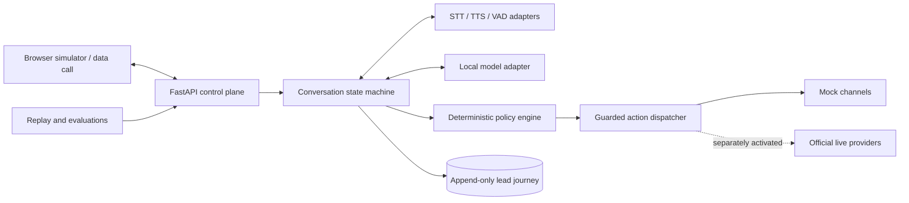

# PitchBot

PitchBot is a zero-cost-first, bilingual sales-assistant project for English and Hindi e-commerce discovery conversations.

## Current status

The implemented application currently provides only:

- Python packaging and development tooling.
- A FastAPI application with a health endpoint.
- Configuration whose external side effects are disabled by default.
- Immutable typed domain contracts.
- Alembic-managed SQLite event, aggregate-version, suppression, and privacy-operation storage.
- Provider-neutral contracts, deterministic in-memory mocks, and resilience primitives.
- A same-origin browser simulator with deterministic sessions, previews, replay, and bounded microphone transport.
- Streaming speech turn-taking in the simulator: a voice-activity-detector contract with a deterministic mock, an endpointing/barge-in state machine, and a transcription pipeline wired to the audio WebSocket so a spoken utterance becomes an ordinary turn. No speech-to-text provider is selected, so utterances report `transcriber-unavailable`; audio is buffered only for the utterance in flight, byte-capped, and never persisted.
- Versioned speech/runtime candidate and corpus manifests with reproducible metrics and a validation CLI, plus a deterministic, dependency-free synthetic voice-activity benchmark (`run-speech`) that regenerates a hash-verified corpus at run time and gates VAD structural F1 in CI. STT and TTS measurement remains blocked pending reviewed audio.
- An optional `py-webrtcvad` adapter behind the voice-activity contract, measured against that corpus. **No voice-activity provider is selected:** it fails the suite threshold in every aggressiveness mode, while a trivial energy threshold scores perfectly on the same clips, so the synthetic corpus cannot yet rank an acoustic detector against an energy heuristic. The dependency is optional and absent by default.
- Versioned privacy-minimized evaluation snapshots, suite-aware fail-closed gate validation that returns a non-zero exit code and fails the build on a regression, and dependency-free local HTML reports.
- Deterministic English/Hindi/Hinglish conversation safety, bounded discovery, requirement revisions, and evidence-grounded Hot/Warm/Cold/Review classification.
- Default-off simulator conversation journaling with restart recovery, bounded minimized replay, idempotent operations, incremental state transitions, optimistic concurrency, and privacy lifecycle compatibility.
- Dependency-free BM25 retrieval over privacy-validated current structured facts with provenance and portable multilingual evaluation.
- Rebuildable temporal lead knowledge views with explicit supersession and conservative cross-session conflict handling.
- Graph-aware, non-authoritative lead retrieval over current and conflicting temporal claims (superseded claims excluded), with a reviewed multilingual graph-retrieval evaluation suite that gates recall, ranking, and superseded-claim exposure.
- Non-authoritative lead recall wired into the simulator turn path: after the durable commit, a budgeted graph-aware read surfaces the lead's own prior claims read-only in the browser demo, skipped on any safety signal, a non-continuing disposition, or durable replay, run off the event loop under a per-session failure budget, and never used to shape the reply.
- Deny-by-default mock action policy with unconditional AI-disclosure, allowlist, DND, and calling-hours gates; minimized follow-ups; fake-time callback scheduling; and six-industry structured sample-deck previews.
- CI, contribution, security, and branch-gate documentation.

Durable simulator history requires an explicitly managed key and an Alembic-migrated database, and is off by default. BM25 retrieval and the temporal knowledge view are now surfaced in the simulator turn path as advisory, display-only lead recall, run after the durable commit; they are not used in reply generation, classification, or the speech response path. In-memory timelines, callback/action state, consent/contact policy, and artifacts remain process-local. Model-backed extraction, vector retrieval, concrete speech-to-text/text-to-speech providers and any model-backed speech recognition or synthesis, durable scheduling, binary deck rendering, deployment, telephony, and live WhatsApp are intentionally deferred to separately reviewed pull requests.

## Target architecture



The target design uses three profiles:

- **`local-full`** — authoritative zero-cost development and evaluation on existing hardware.
- **`hosted-demo`** — optional synthetic-data-only demonstration with no SLA or live side effects.
- **`live-disabled`** — future official provider adapters requiring compliance and operator activation.

See [Architecture](docs/ARCHITECTURE.md) for component, sequence, deployment, data-flow, provider-boundary, and latency details.

## Safety and compliance

When live capabilities are implemented, PitchBot must identify itself as an AI sales assistant. The target policy design blocks live outreach until consent/legal-basis, DND, calling-hour, suppression, recording, privacy, official-provider, usage-cap, and operator-approval gates pass. Unknown policy state must fail closed.

See:

- [Compliance and privacy gates](docs/COMPLIANCE_AND_PRIVACY.md)
- [Threat model](docs/THREAT_MODEL.md)
- [Operations, cleanup, and rollback](docs/OPERATIONS.md)
- [Domain and storage model](docs/DATA_MODEL.md)
- [Provider contracts and deterministic mocks](docs/PROVIDER_CONTRACTS.md)
- [Browser simulator](docs/SIMULATOR.md)
- [Deterministic BM25 retrieval](docs/RETRIEVAL.md)
- [Temporal lead knowledge view](docs/KNOWLEDGE_GRAPH.md)
- [Speech and local runtime benchmarks](docs/BENCHMARKS.md)
- [Source register](docs/SOURCES.md)
- [Architecture decisions](docs/adrs/)

## Requirements

- Python 3.12

## Local setup

```powershell
python -m venv .venv
.venv\Scripts\Activate.ps1
python -m pip install --upgrade pip
python -m pip install -r requirements-dev.lock
python -m pip install -e . --no-deps
Copy-Item .env.example .env
python -m uvicorn pitchbot.main:app --reload
```

Open `http://127.0.0.1:8000/health` to confirm the API is running.
Open `http://127.0.0.1:8000/simulator/` for the synthetic browser simulator.

## Validation

```powershell
ruff check .
ruff format --check .
mypy src tests
python -m pytest
python -m pip_audit
```

## Foundation safety defaults

Telephony, WhatsApp, external network access, and hosted-demo behavior are disabled by default in `.env.example`, and those flags gate their respective capabilities in code. Never commit `.env`, credentials, phone numbers, personal audio, or live transcripts.

The AI-disclosure, contact-allowlist, DND, and calling-hours checks are enforced **unconditionally** by the action policy (`src/pitchbot/actions/policy.py`): each blocks a synthetic action outright — `DISCLOSURE_MISSING`, `NOT_ALLOWLISTED`, `DND_NOT_PASSED`, `CALLING_HOURS_NOT_PASSED` — and there is no configuration setting that can turn any of them off. Removing the never-wired `require_*`/`allowlist_enabled` toggles keeps it that way: a mandatory safety gate cannot be relaxed by editing `.env`.

`PITCHBOT_ENABLE_REAL_TIME_AUDIO=false` remains in `.env.example`, but it is currently **inert** — no code reads it, so the "real-time audio disabled by default" claim is a documented intention, not a code-enforced gate. The simulator's audio socket is always available. This flag must be wired to gate the audio socket, or removed, before any live channel ships (see [PROGRESS.md](docs/PROGRESS.md), PR 29, Deferred).

See [CONTRIBUTING.md](CONTRIBUTING.md), [SECURITY.md](SECURITY.md), and [branching and merge gates](docs/BRANCHING_AND_GATES.md).
