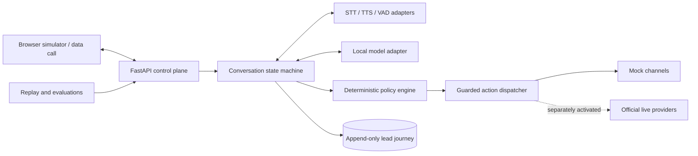

# PitchBot

PitchBot is a zero-cost-first, bilingual sales-assistant project for English and Hindi e-commerce discovery conversations.

## Current status

The implemented application currently provides only:

- Python packaging and development tooling.
- A FastAPI application with a health endpoint.
- Configuration whose external side effects are disabled by default.
- Immutable typed domain contracts.
- Alembic-managed SQLite event, aggregate-version, suppression, and privacy-operation storage.
- Provider-neutral contracts, deterministic in-memory mocks, and resilience primitives.
- A same-origin browser simulator with deterministic sessions, previews, replay, and bounded microphone transport.
- Versioned speech/runtime candidate and corpus manifests with reproducible metrics and validation CLI.
- Versioned privacy-minimized evaluation snapshots, strict gate validation, and dependency-free local HTML reports.
- Deterministic English/Hindi/Hinglish conversation safety, bounded discovery, requirement revisions, and evidence-grounded Hot/Warm/Cold/Review classification.
- Deny-by-default mock action policy, minimized follow-ups, fake-time callback scheduling, and six-industry structured sample-deck previews.
- CI, contribution, security, and branch-gate documentation.

The simulator conversation, callback, and artifact state is process-local and is not yet connected to durable storage. Model-backed extraction, concrete speech/model providers, durable scheduling, binary deck rendering, deployment, telephony, and live WhatsApp are intentionally deferred to separately reviewed pull requests.

## Target architecture



The target design uses three profiles:

- **`local-full`** — authoritative zero-cost development and evaluation on existing hardware.
- **`hosted-demo`** — optional synthetic-data-only demonstration with no SLA or live side effects.
- **`live-disabled`** — future official provider adapters requiring compliance and operator activation.

See [Architecture](docs/ARCHITECTURE.md) for component, sequence, deployment, data-flow, provider-boundary, and latency details.

## Safety and compliance

When live capabilities are implemented, PitchBot must identify itself as an AI sales assistant. The target policy design blocks live outreach until consent/legal-basis, DND, calling-hour, suppression, recording, privacy, official-provider, usage-cap, and operator-approval gates pass. Unknown policy state must fail closed.

See:

- [Compliance and privacy gates](docs/COMPLIANCE_AND_PRIVACY.md)
- [Threat model](docs/THREAT_MODEL.md)
- [Operations, cleanup, and rollback](docs/OPERATIONS.md)
- [Domain and storage model](docs/DATA_MODEL.md)
- [Provider contracts and deterministic mocks](docs/PROVIDER_CONTRACTS.md)
- [Browser simulator](docs/SIMULATOR.md)
- [Speech and local runtime benchmarks](docs/BENCHMARKS.md)
- [Source register](docs/SOURCES.md)
- [Architecture decisions](docs/adrs/)

## Requirements

- Python 3.12

## Local setup

```powershell
python -m venv .venv
.venv\Scripts\Activate.ps1
python -m pip install --upgrade pip
python -m pip install -r requirements-dev.lock
python -m pip install -e . --no-deps
Copy-Item .env.example .env
python -m uvicorn pitchbot.main:app --reload
```

Open `http://127.0.0.1:8000/health` to confirm the API is running.
Open `http://127.0.0.1:8000/simulator/` for the synthetic browser simulator.

## Validation

```powershell
ruff check .
ruff format --check .
mypy src tests
python -m pytest
python -m pip_audit
```

## Foundation safety defaults

Telephony, WhatsApp, external network access, real-time audio, and hosted-demo behavior are disabled in `.env.example`. Never commit `.env`, credentials, phone numbers, personal audio, or live transcripts.

See [CONTRIBUTING.md](CONTRIBUTING.md), [SECURITY.md](SECURITY.md), and [branching and merge gates](docs/BRANCHING_AND_GATES.md).
