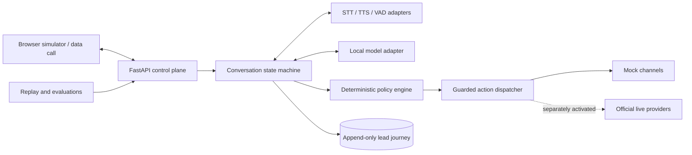

# PitchBot

PitchBot is a zero-cost-first, bilingual sales-assistant project for English and Hindi e-commerce discovery conversations.

## Current status

The implemented application currently provides only:

- Python packaging and development tooling.
- A FastAPI application with a health endpoint.
- Configuration whose external side effects are disabled by default.
- Immutable typed domain contracts.
- Alembic-managed SQLite event, aggregate-version, suppression, and privacy-operation storage.
- Provider-neutral contracts, deterministic in-memory mocks, and resilience primitives.
- A same-origin browser simulator with deterministic sessions, previews, replay, and bounded microphone transport.
- Streaming speech turn-taking in the simulator: a voice-activity-detector contract with a deterministic mock, an endpointing/barge-in state machine, and a transcription pipeline wired to the audio WebSocket so a spoken utterance becomes an ordinary turn. No speech-to-text provider is selected, so utterances report `transcriber-unavailable`; audio is buffered only for the utterance in flight, byte-capped, and never persisted.
- Versioned speech/runtime candidate and corpus manifests with reproducible metrics and a validation CLI, plus a deterministic, dependency-free synthetic voice-activity benchmark (`run-speech`) that regenerates a hash-verified corpus at run time and gates VAD structural F1 in CI. STT and TTS measurement remains blocked pending reviewed audio.
- An optional `py-webrtcvad` adapter behind the voice-activity contract, measured against that corpus. **No voice-activity provider is selected:** it fails the suite threshold in every aggressiveness mode, while a trivial energy threshold scores perfectly on the same clips, so the synthetic corpus cannot yet rank an acoustic detector against an energy heuristic. The dependency is optional and absent by default.
- An optional Piper adapter behind the text-to-speech contract — the first provider that actually produces speech. It streams one chunk per sentence off the event loop, always terminates a stream with exactly one final chunk, and can synthesise reproducibly. **No text-to-speech provider or voice is selected**, and the required license review returned a blocking finding: **no published Piper Hindi voice is cleared for commercial use**, and the commonly used `en_US-amy-low` is not either. The voice registry is deny-by-default, refusing non-commercial or unverifiable voices unless a caller explicitly opts in for local evaluation. Voices are operator-supplied and never downloaded; the Piper runtime is GPL-3.0-or-later and is never vendored.
- An optional `faster-whisper` adapter behind the speech-to-text contract — the first provider that recognises speech. Licences are permissive throughout (package and weights MIT, upstream Whisper Apache-2.0) and weights are never downloaded: the adapter runs `local_files_only=True` unless a caller explicitly opts in. It is deliberately **utterance-batch rather than chunk-streamed**, because Whisper encodes a padded 30-second window, making cost roughly constant per call — measured, twelve times the audio costs 1.9x the time — so the number that matters is **~2.1 s latency after end-of-speech**, not real-time factor. Non-final partials are cumulative and exactly one final chunk carries the complete transcript. Audio at any rate other than 16 kHz is refused rather than silently reinterpreted, and a language is reported as `unknown` rather than guessed when detection is weak. **No speech-to-text provider is selected** and no word-error-rate is claimed: only synthesised speech is available, which cannot separate recognition quality from synthesis quality.
- Speech providers are now **selectable from configuration**, which is what makes the two adapters above actually reachable from the running application — until now nothing constructed them. `PITCHBOT_SPEECH_VAD_PROVIDER` and `PITCHBOT_SPEECH_STT_PROVIDER` default to `mock` and `none`, reproducing exactly the behaviour that shipped before the adapters existed, and **naming a provider whose optional extra is absent is a startup error rather than a silent downgrade** — falling back would leave an operator believing speech works while every utterance is dropped. Model weights are loaded once during application startup rather than during the first buyer utterance: measured end to end, a lazily-loaded transcriber made the first spoken turn take **5,384 ms**, which dropped to **3,502 ms** once loading moved to startup. `/health` reports which providers are actually running.
- The reply can now be **spoken by the server**, over the same socket that carries the buyer's speech, instead of by the browser's own `speechSynthesis` — whose voices vary by browser and OS, frequently lack Hindi, and on several platforms are produced by a *remote* service. `PITCHBOT_SPEECH_TTS_PROVIDER` defaults to `none`, so that fallback is unchanged unless a voice is configured. Piper emits one chunk per *sentence* (measured 80 KB to 352 KB, the largest carrying 7.99 s of audio), which is both too large to write and impossible to abandon part-way, so the stream is re-cut into 32 KB sample-aligned frames that barge-in can actually stop. Synthesis runs at **~19x realtime** once the voice is resident, so the reply is delivered long before it finishes playing — but it runs as a background task rather than inline, because the 1,052 ms a long reply costs would otherwise blind the interruption detector on every turn. Verified by closing the loop: PCM received over the WebSocket, fed back through `faster-whisper`, returned the reply verbatim. **No text-to-speech provider or voice is selected**, and no reviewed Piper Hindi voice permits commercial use.
- The agent now **plans what to say** instead of returning one fixed sentence per language every turn. A deterministic planner reads the four slots the conversation has filled — business type, requested features, budget, timeline — acknowledges what was just learned, and asks for the most useful missing one, abandoning a slot after two unanswered attempts. It needs no model, costs ~1 ms, and works offline. The rendered reply is composed of fixed phrases only, so no buyer text can reach the agent's own words.
- An optional **local language model** behind the previously unimplemented text model contract, run on CPU through `onnxruntime-genai` (MIT, no PyTorch; chosen because `llama-cpp-python` publishes no Windows wheel on PyPI at any version). Its output is **structurally constrained** to a JSON schema rather than parsed out of prose. It improves *understanding* of code-mixed input and feeds the same planner, so it can never change how a reply is composed. **No model is selected**: measured on an 8-core CPU, a 0.5B model answers in 950 ms but scored 1/10, while a 3.8B model scored 10/10 at ~5.2 s per turn — too slow for the spoken path, so it is off by default. Licence review found the Qwen2.5 family is **licence-split** (0.5B/1.5B Apache-2.0, 3B non-commercial) and that Hindi coverage among licence-clean small models is weak.
- Versioned privacy-minimized evaluation snapshots, suite-aware fail-closed gate validation that returns a non-zero exit code and fails the build on a regression, and dependency-free local HTML reports.
- Deterministic English/Hindi/Hinglish conversation safety, bounded discovery, requirement revisions, and evidence-grounded Hot/Warm/Cold/Review classification.
- Default-off simulator conversation journaling with restart recovery, bounded minimized replay, idempotent operations, incremental state transitions, optimistic concurrency, and privacy lifecycle compatibility.
- Dependency-free BM25 retrieval over privacy-validated current structured facts with provenance and portable multilingual evaluation.
- Rebuildable temporal lead knowledge views with explicit supersession and conservative cross-session conflict handling.
- Graph-aware, non-authoritative lead retrieval over current and conflicting temporal claims (superseded claims excluded), with a reviewed multilingual graph-retrieval evaluation suite that gates recall, ranking, and superseded-claim exposure.
- Non-authoritative lead recall wired into the simulator turn path: after the durable commit, a budgeted graph-aware read surfaces the lead's own prior claims read-only in the browser demo, skipped on any safety signal, a non-continuing disposition, or durable replay, run off the event loop under a per-session failure budget, and never used to shape the reply.
- Deny-by-default mock action policy with unconditional AI-disclosure, allowlist, DND, and calling-hours gates; minimized follow-ups; fake-time callback scheduling; and six-industry structured sample-deck previews.
- CI, contribution, security, and branch-gate documentation.

Durable simulator history requires an explicitly managed key and an Alembic-migrated database, and is off by default. BM25 retrieval and the temporal knowledge view are now surfaced in the simulator turn path as advisory, display-only lead recall, run after the durable commit; they are not used in reply generation, classification, or the speech response path. In-memory timelines, callback/action state, consent/contact policy, and artifacts remain process-local. Model-backed extraction, vector retrieval, durable scheduling, binary deck rendering, deployment, telephony, and live WhatsApp are intentionally deferred to separately reviewed pull requests. Speech-to-text and text-to-speech now have optional adapters and are both reachable from configuration; no provider is selected, and server-side synthesis covers spoken turns only — a typed turn is still spoken by the browser.

### Optional extras

Both speech providers are optional and absent by default. `pitchbot` imports and the whole
test suite passes without either, and neither is re-exported from `pitchbot.adapters`, so
the core import graph structurally cannot depend on them.

```powershell
python -m pip install -e ".[webrtc-vad]"      # MIT AND BSD-3-Clause, ~19 KiB, no weights
python -m pip install -e ".[piper-tts]"       # GPL-3.0-or-later; voices supplied separately
python -m pip install -e ".[faster-whisper]"  # MIT; model weights supplied separately
```

The Piper extra installs a **GPL-3.0-or-later** runtime. PitchBot never vendors or
redistributes it, and installing it is a deliberate act by the operator, who then owns the
obligations of whatever they distribute. It installs **no voices**: each voice is a separate
file with its own license that the operator places on disk, and PitchBot never downloads
one. See [docs/BENCHMARKS.md](docs/BENCHMARKS.md) for the full distribution and per-voice
license review.

The faster-whisper extra is permissively licensed throughout, but it likewise installs **no
model weights**. The adapter runs with `local_files_only=True` unless a caller explicitly
opts in, so a missing model is a clear error rather than a silent multi-hundred-megabyte
download in the middle of a call — or in the middle of CI.

## Target architecture



The target design uses three profiles:

- **`local-full`** — authoritative zero-cost development and evaluation on existing hardware.
- **`hosted-demo`** — optional synthetic-data-only demonstration with no SLA or live side effects.
- **`live-disabled`** — future official provider adapters requiring compliance and operator activation.

See [Architecture](docs/ARCHITECTURE.md) for component, sequence, deployment, data-flow, provider-boundary, and latency details.

## Safety and compliance

When live capabilities are implemented, PitchBot must identify itself as an AI sales assistant. The target policy design blocks live outreach until consent/legal-basis, DND, calling-hour, suppression, recording, privacy, official-provider, usage-cap, and operator-approval gates pass. Unknown policy state must fail closed.

See:

- [Compliance and privacy gates](docs/COMPLIANCE_AND_PRIVACY.md)
- [Threat model](docs/THREAT_MODEL.md)
- [Operations, cleanup, and rollback](docs/OPERATIONS.md)
- [Domain and storage model](docs/DATA_MODEL.md)
- [Provider contracts and deterministic mocks](docs/PROVIDER_CONTRACTS.md)
- [Browser simulator](docs/SIMULATOR.md)
- [Deterministic BM25 retrieval](docs/RETRIEVAL.md)
- [Temporal lead knowledge view](docs/KNOWLEDGE_GRAPH.md)
- [Speech and local runtime benchmarks](docs/BENCHMARKS.md)
- [Source register](docs/SOURCES.md)
- [Architecture decisions](docs/adrs/)

## Requirements

- Python 3.12

## Local setup

```powershell
python -m venv .venv
.venv\Scripts\Activate.ps1
python -m pip install --upgrade pip
python -m pip install -r requirements-dev.lock
python -m pip install -e . --no-deps
Copy-Item .env.example .env
python -m uvicorn pitchbot.main:app --reload
```

Open `http://127.0.0.1:8000/health` to confirm the API is running.
Open `http://127.0.0.1:8000/simulator/` for the synthetic browser simulator.

## Validation

```powershell
ruff check .
ruff format --check .
mypy src tests
python -m pytest
python -m pip_audit
```

## Foundation safety defaults

Telephony, WhatsApp, external network access, and hosted-demo behavior are disabled by default in `.env.example`, and those flags gate their respective capabilities in code. Never commit `.env`, credentials, phone numbers, personal audio, or live transcripts.

The AI-disclosure, contact-allowlist, DND, and calling-hours checks are enforced **unconditionally** by the action policy (`src/pitchbot/actions/policy.py`): each blocks a synthetic action outright — `DISCLOSURE_MISSING`, `NOT_ALLOWLISTED`, `DND_NOT_PASSED`, `CALLING_HOURS_NOT_PASSED` — and there is no configuration setting that can turn any of them off. Removing the never-wired `require_*`/`allowlist_enabled` toggles keeps it that way: a mandatory safety gate cannot be relaxed by editing `.env`.

`PITCHBOT_ENABLE_REAL_TIME_AUDIO=false` remains in `.env.example`, but it is currently **inert** — no code reads it, so the "real-time audio disabled by default" claim is a documented intention, not a code-enforced gate. The simulator's audio socket is always available. This flag must be wired to gate the audio socket, or removed, before any live channel ships (see [PROGRESS.md](docs/PROGRESS.md), PR 29, Deferred).

See [CONTRIBUTING.md](CONTRIBUTING.md), [SECURITY.md](SECURITY.md), and [branching and merge gates](docs/BRANCHING_AND_GATES.md).
