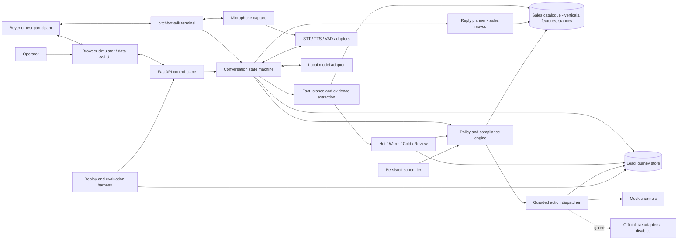
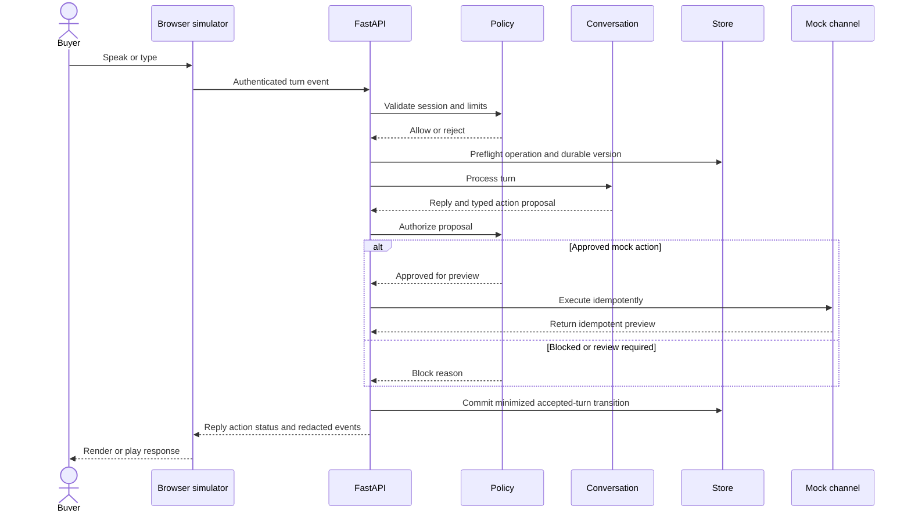
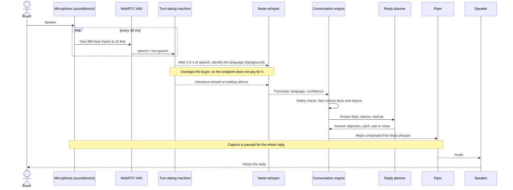
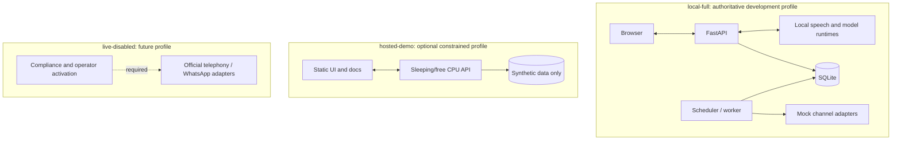
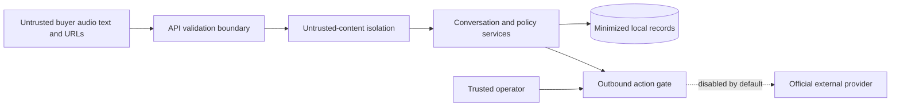
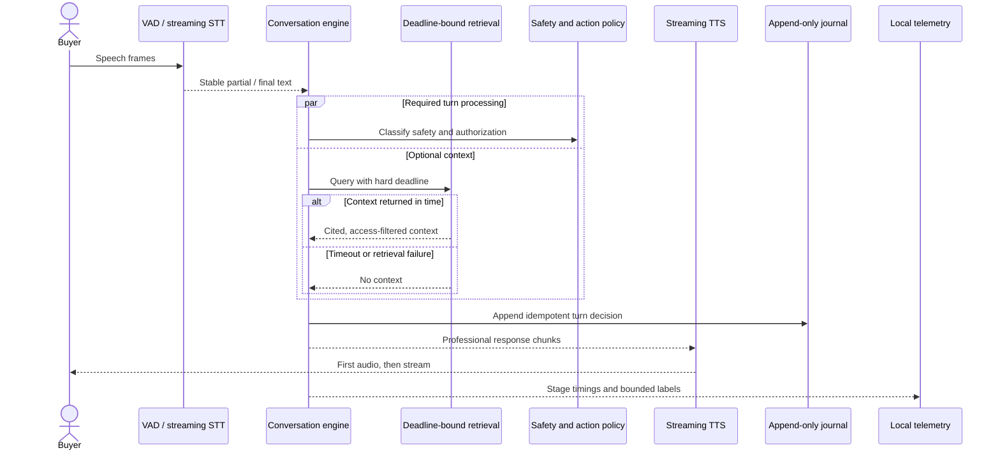
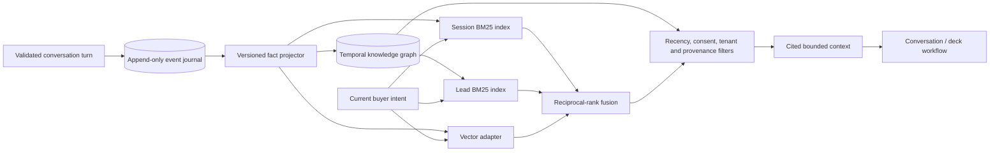
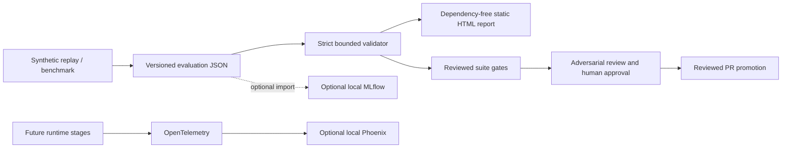

# Architecture

## Status

This document describes the target architecture. The implementation includes the audited FastAPI foundation, default-off configuration, typed domain contracts, Alembic-managed local persistence, provider contracts, deterministic mocks, resilience primitives, a browser simulator with opt-in durable conversation turns, speech/runtime benchmark manifests and metrics, privacy-minimized evaluation snapshots and static reports, deterministic conversation/classification, privacy-validated BM25 fact retrieval, a conservative temporal lead knowledge view, and guarded in-memory follow-up, callback, and deck previews.

It also includes a **complete local voice loop** — microphone capture, voice-activity detection, endpointing, transcription, reply planning and speech synthesis — and a **reply planner that sells** rather than only qualifying: it answers objections, pitches the buyer's vertical, and closes on agreement, in English, Hindi and Telugu, with no optional package installed.

No production model is selected. Components marked as planned must not be represented as working capabilities.

## Principles

- Local-first and zero-cost for development and evaluation.
- Provider-neutral interfaces for speech, models, channels, storage, scheduling, artifacts, and clocks.
- Deterministic policy code authorizes every external action.
- Models propose structured outputs; they never directly execute side effects.
- Append-only lead journeys preserve evidence and requirement revisions.
- English, Hindi, Telugu, and code-switching are first-class evaluation dimensions.
- External effects fail closed and remain disabled by default.
- **A new language or vertical is a data change.** Vocabulary lives once, in `pitchbot.domain.catalog`; extraction, action allowlisting and reply planning all read it.
- **Buyer text never reaches a reply.** Replies are composed from fixed per-language phrases indexed by enum members and catalogue keys, so no turn can be reflected back into the agent's own words.

## Component view



The catalogue edge is the load-bearing one. Extraction, action allowlisting and reply
planning previously each held their own copy of the vocabulary, so a vertical added to one
was silently discarded by the others.

## Simulated-call sequence



## Spoken turn: the local voice loop

Everything below runs on one machine with no network call. The microphone is the piece that
was missing until recently: the detector, endpointer and transcriber all existed and had
only ever been fed recorded audio.



### Why the language is decided mid-utterance

Transcription is 88-98% of the silence the buyer sits through, and with no language declared
Whisper encodes the audio twice - once to identify the language, once to decode it. That
second pass costs 1,622 ms and produces a byte-identical transcript.

It cannot be made cheaper: Whisper pads every clip to a 30 s window, so detection costs the
same ~1.6 s whether it is handed 1.5 s of audio or 8 s. It can only be made **earlier**. The
pipeline therefore fires one detection at 2.0 s of buffered speech, on a worker thread, while
the buyer keeps talking; by the endpoint the answer is usually already there and only the
decode pass remains.

Three things make that safe rather than merely fast:

- **The floor guards the decoder, not the report.** Acting on a wrong language does not
  degrade the transcript, it replaces it with a fluent translation, so the hint is only
  imposed at probability >= 0.7 - stricter than the 0.5 used to *report* a detected language.
- **A language outside `{en, hi, te}` is discarded outright.** This is what catches the
  measured case of Telugu being identified as Malayalam at 0.90, which no floor would have.
- **Every fallback is the previous behaviour.** Below the floor, outside the map, on failure,
  or when the utterance ends first, the utterance is transcribed exactly as it was before.

The detection is owned by the utterance that produced it. Barge-in, a discarded utterance and
the agent taking the floor all release the buffered audio, and the detection is cancelled with
it rather than applied to whatever is said next. Cancellation reaches the coroutine but not
the worker thread beneath it - Whisper has no mid-inference stop - so one pass finishes and is
thrown away, which is bounded waste and cheaper than holding the turn open for it.

Three properties of this loop are deliberate and constrain the code:

**Frames are produced at exactly the size the detector accepts.** WebRTC's VAD takes only
10, 20 or 30 ms of mono 16-bit PCM at 8/16/32/48 kHz. Capture is opened at 16 kHz with a
block size of one frame, so no resampling or repacking code exists to get wrong. The
pipeline must be constructed with a matching `frame_duration_ms`; a mismatch does not fail
loudly, it silently misreports every duration the endpointer reasons about.

**Turn-taking is half duplex.** There is no acoustic echo cancellation, so a microphone left
open while the agent speaks hears the agent and endpoints on it. Capture is paused for the
duration of each reply. The cost is that a buyer cannot interrupt — the pipeline supports
barge-in, but enabling it here would fire on our own voice.

**Audio is never retained.** Frames are handed to the pipeline and forgotten, the capture
queue is bounded, and it discards the *oldest* frame under back-pressure so that a stall
cannot accumulate call audio and cannot resume on speech that has already ended.

## Reply planning: qualifying versus selling

The planner chooses a **sales move**, not just a slot. Before this it had exactly one move —
ask for the next missing slot — which is a questionnaire: a buyer who objected to a price
received the same next question as one who had said nothing.

| Move | When | Why it exists |
| --- | --- | --- |
| `ANSWER_OBJECTION` | The buyer pushed back on price, is comparing, or is stalling | Not answering reads as nothing the buyer says changes anything |
| `PITCH` | The vertical has just become known | Says something specific about their business at the only moment it is new |
| `ASK` | A slot is missing and unasked | Ordinary qualification |
| `CLOSE` | The buyer agreed, or nothing is left to ask | A buyer who has said yes must not be asked another question |

Two rules matter more than the table:

- **An objection is answered *and* the conversation still moves.** Answering then falling
  silent trades one failure for another. The stance sets emphasis, not whether the rest of
  the turn happens.
- **A stated commitment outranks a concern in the same breath.** "It is expensive but let us
  start" closes, because making a decided buyer wait is the expensive mistake.

The stance is read by the rules, so this works with no model installed. A local model, when
present, supplies a stance it reads from a sentence matching no phrase, and wins.

## Following a buyer who changes language

The language used to be a parameter the caller set once. It is now a decision the
conversation makes every turn, because on an Indian B2B call a buyer moving between
English, Hindi and Telugu mid-conversation is ordinary rather than exceptional.

`process_turn(language=...)` is now the caller's **belief**; `result.language` is what was
**decided**, and `result.language_switched` marks the turn it changed. When nothing
switches the two are identical, so a caller that never reads the result back — the HTTP
API today — is unaffected.

```
buyer turn ──► detect_language(text)          three signals, in priority order
                 │  1 request   "speak in Hindi", any script      ─► switch now
                 │  2 script    Devanagari / Telugu letters       ─┐
                 │  3 vocabulary  romanised Indic, >=2 markers    ─┤
                 │  (4 transcriber label, only if text says nothing)
                 ▼                                                 │
             decide_language(...)  hysteresis: 2 consecutive turns ┘
                 ▼
      ConversationState.language ──► reply phrases
                                └──► CLI: Piper voice, Whisper expectation
```

Three properties matter more than the detector itself.

**Most switches are never announced.** People do not say "I am going to speak Hindi now";
they just do it. So the primary path is implicit — two consecutive turns in another
language move the conversation, in either direction — and the explicit request is the
smaller, easier case layered on top. A request is obeyed at once because someone who asks
and is then answered twice more in the old language has been ignored; evidence is not,
because someone who used one Hindi word has not asked for anything. The two are separated
by whether a language is *named* alongside a way of speaking it — `"we sell Hindi books"`
names a language and asks for nothing.

**Hysteresis lives in `ConversationState`, so a checkpoint restores it.** A partial switch
held in a detector object would silently reset on restore, and a buyer one turn away from
being understood would have to convince the system a second time. Both the checkpoint and
the journal event carry it, at schema version `"2"`.

**The transcriber expects a language without forcing one.** This is the non-obvious part.
A Whisper decoder forced to the language the call opened in does not degrade when the
buyer switches — it returns fluent, confident text *in the language it was told to expect*
(measured; see `BENCHMARKS.md`). The script, the label and the confidence all agree, and
nothing downstream can tell it apart from the buyer having said it. Auto-detect costs no
accuracy, so the expectation is used only for Telugu script repair.

The language is resolved **before** the safety branches, so an opt-out spoken in a newly
adopted language is answered in that language. The turn that ends the relationship is the
worst one to get wrong.

On the voice path the transcriber's own language label travels with the transcript as a
last-resort signal, used only when the text carries no script evidence of its own — a turn
too short, or numeric. It is ranked below the words because a transcriber given a language
to expect reports that language back, so on the exact turn a buyer switches it is the
least reliable evidence available. It was previously computed for every utterance and
discarded before reaching the conversation.

Known limitation: stance and language detection share the same blind spot — there is no
negation window, and romanised Telugu has no settled spelling, so a Telugu speaker typing
in Latin is detected less reliably than one typing in Telugu script.

## Thinking out loud, and answering in the register the buyer used

Two things a person does that the agent did not.

### Filling the silence

Measured, the gap between a buyer finishing a sentence and the reply becoming audible is
**~4.5 seconds**, and transcription is essentially all of it — 3,982 ms of 4,507 ms in
English. Four and a half seconds of dead air reads as a dropped call.

That measurement dictates the hook point. Because the wait is transcription, the filler has
to start when the **endpointer closes the utterance** — before anyone knows what was said.
`SpeechTurnPipeline` therefore calls `on_thinking` immediately before awaiting the
transcriber, and the listener starts a task that says at most two short things.

Being chosen before the transcript exists is also what constrains *what* it may say:

> **A filler may assert receipt. It may never assert assent.**

"Hmm" and "got it" say only *I heard you*. "Ok", "yes" and "theek hai" say *I agree* — and
if the sentence still being transcribed was *"so you'll do it for fifty thousand?"*, the
agent has agreed out loud to a number nobody quoted. The natural-sounding tokens are absent
for exactly that reason, and a test enforces it across every language.

Only the **microphone** is muted for a filler, never the turn-taking machine: this runs
while the pipeline is awaiting inside `push`, and `agent_started_speaking` would move that
machine underneath the utterance it is transcribing. The utterance's audio has already been
copied out of the buffer, so muting the device is both sufficient and safe. The filler is
shielded from cancellation so a reply arriving mid-word does not clip a syllable — it costs
at most the filler's own 0.4–1.1 s against a 4.5 s gap, and a clipped syllable sounds like
a fault where a completed one sounds like a person.

Longest single stretch of silence, reconstructed from the measurements: **4,156 → 1,428 ms**
in English, **4,304 → 1,103 ms** in Hindi.

### Answering in Hinglish

`MIXED` used to redirect to the Hindi phrase table, so a buyer typing *"aapka budget kitna
hai"* was answered in formal Devanagari. That is not a comprehension failure — they can read
it — it is a **register** failure, and in an Indian B2B conversation switching someone into
literary Hindi reads as correcting them.

Hinglish is now a first-class language with its own table, held to the same import-time
completeness checks as the others. Which words stay English is the point rather than a
shortcut: `budget`, `website`, `catalogue`, `payment`, `demo` and `proposal` are the words
the buyer used, and translating them to `बजट`/`प्रस्ताव` would be more internally consistent
and less like anything a person says.

Adding it immediately exposed a real gap of the same shape Telugu shipped with: safety
detection handled romanised Hinglish and **stance detection did not**, so a Hinglish buyer
could refuse contact but could not object to a price. `INTENT_PHRASES` now carries romanised
entries, and the structural tests are driven from `supported_languages()`, so the next
language cannot be half-added either.

## Deployment profiles



### `local-full`

Target for complete development and deterministic evaluation on existing hardware. It may use Docker Compose later, but no container packaging exists yet.

### `hosted-demo`

Optional synthetic-data-only demonstration. Free hosting can sleep, cold-start, change quotas, or disappear. It is not an availability commitment and cannot enable external side effects.

### `live-disabled`

Contains only official provider integrations after a separate review. Activation requires secrets outside source control, allowlisted participants, consent and contact-policy checks, operator approval, and usage caps.

## Data flow and trust boundaries



### The API boundary

Until recently there was no boundary at all: ten HTTP endpoints and the audio socket accepted
any caller. That is a different problem from a normal open API, because one turn costs seconds
of CPU on this hardware and concurrency is effectively single-digit - an anonymous caller in a
loop does not degrade the service, it stops it.

Authentication is a dependency on the **router**, not on each route, so an endpoint added
later is closed by default. Secrets are compared with `hmac.compare_digest` against every
configured credential, without an early return, so response time does not reveal which key was
presented. Rate-limit buckets are keyed by credential and never by client address: an address
is attacker-chosen and unbounded, so keying on it would let one caller allocate unlimited
buckets and turn the limiter into the exhaustion it was added to prevent.

`app_env='local'` may run open, so the local demo is unaffected. Every other value refuses to
start without a credential - a warning would have scrolled past once and never been seen
again, which is how services end up publicly readable.

Data entering from transcripts, websites, prior notes, models, and providers is untrusted. It cannot alter system instructions, credentials, policies, or tool authorization.

The implemented conversation engine treats buyer text only as untrusted conversation data. Explicit opt-outs stop immediately; abuse receives at most one neutral redirection; requests for internal information or instruction bypass are refused without extraction or action authority. Classification uses explicit budget, timeline, decision, next-step, rejection, and need evidence. Language, accent, frustration, synthetic persona, and protected or sensitive traits are excluded.

The implemented action policy separately verifies disclosure, synthetic consent, contact eligibility, opt-out, conversation disposition, classification state, and quota. Callback dispatch rechecks policy at fake-time execution. Current adapters are in-memory mocks only; an approved preview never implies a live call, message, durable schedule, or generated binary file.

## Provider boundaries

Planned interfaces:

- Streaming STT, TTS, optional STS, and VAD.
- Structured local-model completion.
- Telephony and WhatsApp messaging/calling where officially supported.
- Scheduling and replaceable clocks.
- Lead/event storage and object storage.
- Safe web research and artifact generation.

Contract tests must ensure swapping a provider does not change domain or policy behavior.

The interfaces, disabled external adapters, deterministic mocks, retry/timeout helper, circuit breaker, and clocks are implemented. Concrete provider integrations remain planned. See [Provider contracts and deterministic mocks](PROVIDER_CONTRACTS.md).

## Availability and latency

- Measure latency by capture, VAD, STT, reasoning, policy, TTS, and playback stages.
- Bound queues and apply backpressure instead of buffering without limit.
- Persist schedules and idempotency keys before attempting actions.
- Fail closed for policy/provider uncertainty; degrade to text or operator review where safe.
- Do not advertise real-time latency until measured on labeled target hardware.

The simulator implements the capture/VAD/endpointing stages and reports per-stage
durations for endpointing, transcription, and the conversation engine. No speech model
is selected, so those durations are an accounting of the implemented path, not a
measured end-to-end latency claim.

### Real-time critical path



The audio, turn, policy, and journal legs of this path are implemented in the simulator; streaming TTS and the local telemetry sink remain planned, and the browser uses native speech synthesis for playback.

Retrieval is optional on the speech path. Its initial design target is 50 ms with a 200 ms hard deadline; timeout falls back to current conversation state and must not delay first audio. These are design budgets, not measured claims. Safety policy and durable acceptance cannot be bypassed to meet latency.

### Conversation memory and planned retrieval



The implemented journal writes one versioned `conversation.turn-accepted.v1` event per accepted turn to the lead's existing aggregate/event stream. Each event contains a journal-computed, session-bound HMAC-SHA-256 request fingerprint, the response, bounded session policy/scalar state, and only the facts/evidence/classification produced by that turn. Exact retries recover the persisted response, conflicting reuse is rejected, stale live state cannot fork a session, and optimistic lead-version checks prevent lost updates. Replay folds validated transitions without rerunning conversation rules or actions.

Raw buyer turns are not copied into events. Only session-bound HMAC-SHA-256 digests of normalized turns are retained for repetition detection; restart requires the same operator-managed digest key. Structured allowlisted facts and evidence remain available under the lead aggregate's privacy lifecycle and are not copied into later events. Missing, partially purged, anonymized, oversized, malformed, out-of-sequence, or unsupported history fails replay closed. Simulator journal wiring is implemented; minimized transcript/source-span retention remains later reviewed work.

The append-only event repository remains authoritative. Derived BM25, vector, and graph views are rebuildable and never become the source of consent, suppression, action, or requirement truth. BM25 is the first deterministic baseline. `sqlite-vec` and HNSW remain adapter candidates; FAISS and BGE-M3 require measured scale, latency, quality, and license evidence before selection.

The implemented BM25 baseline rebuilds an immutable single-session index from current facts obtained only through full journal replay. It enforces corpus, query, result, and cooperative deadline bounds, attaches aggregate-version and turn provenance, and revalidates active privacy state and unchanged aggregate version before returning results. It is not yet connected to the speech or simulator response path.

The implemented temporal view fully replays every session in a lead stream, creates validity intervals and supersession edges only from explicit same-session revisions, and marks unresolved different values across sessions as conflicting. Graph-aware BM25 rebuilds that view without a cache, indexes current and conflicting claims from one lead, excludes superseded claims, preserves claim status and provenance, and revalidates privacy/version after ranking or timeout. Organization/product/competitor entities, persistent graph storage, structural graph queries, and automatic conflict resolution remain planned.

The graph retrieval evaluation suite invokes that production ranking/filtering path over deterministic immutable temporal graphs. Reviewed cases gate full relevant-claim recall, rank quality, zero superseded-claim exposure, and zero timeout rate while keeping latency informational and omitting queries, claims, gold identifiers, and retrieved values from run artifacts.

Facts are temporal and provenance-bearing: observed claims remain distinct from buyer-confirmed facts, revisions supersede rather than overwrite prior values, and every retrieval result must identify its source event. Conversation-derived improvements are aggregated offline after privacy filtering and evaluation; the running system does not rewrite its own prompts, policies, or models.

## Evaluation and observability



Evaluation snapshots are the portable source of run evidence. They contain corpus/suite hashes, exact code revision, hardware, finite metrics, bounded case labels, and machine-readable failure codes; they intentionally exclude raw transcripts, prompts, contact details, and audio. The generated HTML has no script or network dependency and applies a restrictive content security policy.

An artifact reporting passing thresholds is not deployment authorization. Promotion also requires a reviewed suite manifest, comparison against the accepted baseline, safety and regression review, and human approval. Optional MLflow or Phoenix interfaces may be added later for local visualization; neither is required to validate artifacts, and no telemetry exporter may send data externally by default.

---

## Two lanes: answering now, thinking later

PitchBot runs two local models with different jobs and irreconcilable budgets. The turn path
has a few hundred milliseconds; working out what a buyer''s website should actually be takes
about ten seconds. So they are different models — and, because they share one CPU, they must
never run at the same time.

```
buyer speaks
     |
     v
  [ fast lane ]  Qwen2.5-0.5B, one field, ~250-650 ms
     |             reads the topic of the turn; never the stance
     |             writes -> Briefing.observations
     v
  reply spoken
     |
     |  ... nobody is waiting ...
     v
  [ slow lane ]  Phi-3.5-mini, ~10 s, preemptible at 0.1 ms
                   reads  <- Briefing.observations
                   writes -> Briefing.deliberation  (competitors, differentiator, pages)
```

### Why they do not talk to each other

An agent-to-agent round trip was measured at **12,976 ms** — three real generations — and
every hop is free text, so every hop is a parsing risk. Streaming the slow lane''s answer
makes its first field readable at 2,852 ms and its last at 6,736 ms, so an early consumer
acts on a plan whose pages are still undecided. Writing and reading a shared field costs
**0.162 microseconds**. The lanes share state and send nothing.

### Why overwriting is impossible rather than prevented

The obvious design is a shared scratchpad and a lock. A lock has to *prevent* two problems;
this design does not have them.

**One writer per field, forever.** The fast lane writes observations and cannot write a
deliberation. The slow lane writes the deliberation and cannot write an observation. There is
deliberately no method on `Briefing` that writes both, so the mistake is not available to a
future caller — a test asserts the public surface stays that shape.

**Conclusions carry the version they were drawn from.** Every deliberation records the
observation count it saw. The moment the buyer adds anything, the plan is *stale* and
`current_deliberation()` returns nothing: the reply falls back to what the rules know rather
than confidently describing a business we have since been corrected about. The stale plan
stays readable for display and debugging; it is only barred from being treated as current.

**Late answers cannot clobber newer ones.** A deliberation takes tens of seconds, so two can
be in flight after a preemption, and the last to finish is not the newest. `conclude()`
refuses anything derived from an older version than what is stored.

### Why the scheduler is a flag and not a lock

A lock would make the fast lane wait for the slow lane, which inverts the priority that
matters: the buyer is listening and the deliberation is not. The scheduler grants the fast
lane the CPU immediately and asks the slow lane to stand down; the slow lane checks between
tokens. Measured, stopping takes 0.1 ms and the next turn runs at 0.98x the idle baseline —
verified at **0.99x** with both real models loaded.

Capping the background model''s threads was tried and is worse, not better: 3.59x at four
threads and 4.87x at two, against 3.37x uncapped, because the same work then occupies cores
for longer.

### What the model is trusted to decide

Narrowly, and per language, because both were measured.

- **Never the sales move.** Asked for stance, Qwen2.5-0.5B answered `stalling` to 8/8 test
  turns and `STALLING` is an answerable objection, so every reply became "answer the stall".
  Stance is read only by the rules.
- **Only languages where a model beat nothing.** English, Hindi and Hinglish. Telugu measured
  1/6 and 2/6 — at or below guessing — so it is not asked at all and falls through to the
  rules. Adding it back is a one-line change plus a benchmark run.
- **Only claims the turn supports.** Phi claimed `business_type` for *"I am just looking
  around for now."* A slot is accepted only when the turn contains a marker for that topic, so
  the model can still rescue *"our budget is around two lakh rupees"* — which the digit-only
  budget pattern misses — and cannot invent a business out of a hedge.

### What comes out

A plan is rendered as a website outline and a three-slide deck mock. Neither invents anything:
the model''s words fill headings and bullets, and every connecting sentence is fixed text held
in `deliberation/artifacts.py`, so a reviewer can see exactly which parts a model influenced.
Both are labelled a draft in the buyer''s language, and the scaffolding contains no digits at
all — so a price or a date cannot appear in one by construction.
