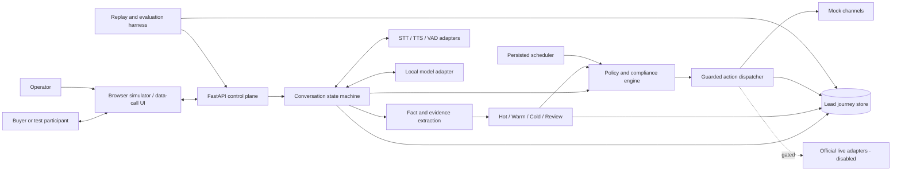
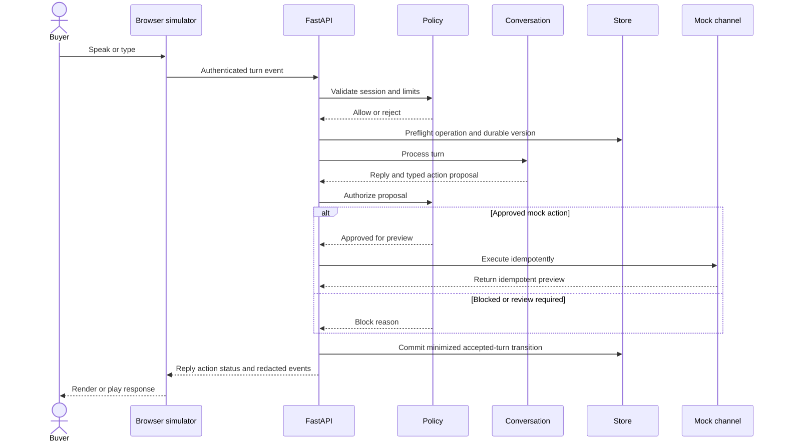
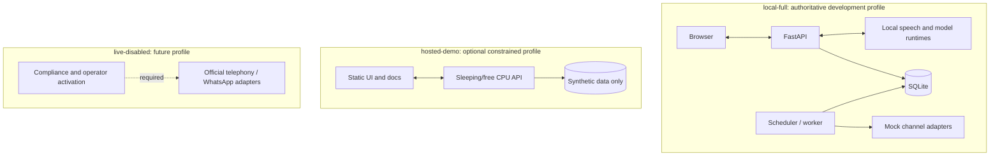
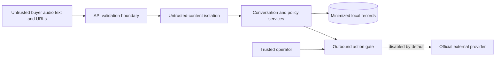
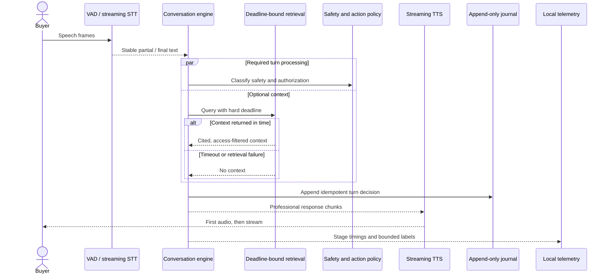
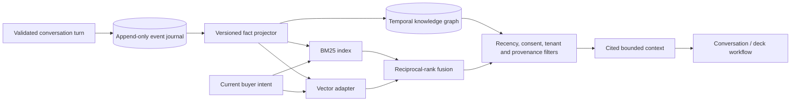
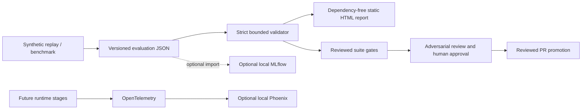

# Architecture

## Status

This document describes the target architecture. The current implementation includes the audited FastAPI foundation, default-off configuration, typed domain contracts, Alembic-managed local persistence, provider contracts, deterministic mocks, resilience primitives, a browser simulator with opt-in durable conversation turns, speech/runtime benchmark manifests and metrics, privacy-minimized evaluation snapshots and static reports, deterministic conversation/classification, privacy-validated BM25 fact retrieval, and guarded in-memory follow-up, callback, and deck previews. No production model is selected. Components marked as planned must not be represented as working capabilities.

## Principles

- Local-first and zero-cost for development and evaluation.
- Provider-neutral interfaces for speech, models, channels, storage, scheduling, artifacts, and clocks.
- Deterministic policy code authorizes every external action.
- Models propose structured outputs; they never directly execute side effects.
- Append-only lead journeys preserve evidence and requirement revisions.
- English, Hindi, and code-switching are first-class evaluation dimensions.
- External effects fail closed and remain disabled by default.

## Component view

## Simulated-call sequence

## Deployment profiles

### `local-full`

Target for complete development and deterministic evaluation on existing hardware. It may use Docker Compose later, but no container packaging exists yet.

### `hosted-demo`

Optional synthetic-data-only demonstration. Free hosting can sleep, cold-start, change quotas, or disappear. It is not an availability commitment and cannot enable external side effects.

### `live-disabled`

Contains only official provider integrations after a separate review. Activation requires secrets outside source control, allowlisted participants, consent and contact-policy checks, operator approval, and usage caps.

## Data flow and trust boundaries

Data entering from transcripts, websites, prior notes, models, and providers is untrusted. It cannot alter system instructions, credentials, policies, or tool authorization.

The implemented conversation engine treats buyer text only as untrusted conversation data. Explicit opt-outs stop immediately; abuse receives at most one neutral redirection; requests for internal information or instruction bypass are refused without extraction or action authority. Classification uses explicit budget, timeline, decision, next-step, rejection, and need evidence. Language, accent, frustration, synthetic persona, and protected or sensitive traits are excluded.

The implemented action policy separately verifies disclosure, synthetic consent, contact eligibility, opt-out, conversation disposition, classification state, and quota. Callback dispatch rechecks policy at fake-time execution. Current adapters are in-memory mocks only; an approved preview never implies a live call, message, durable schedule, or generated binary file.

## Provider boundaries

Planned interfaces:

- Streaming STT, TTS, optional STS, and VAD.
- Structured local-model completion.
- Telephony and WhatsApp messaging/calling where officially supported.
- Scheduling and replaceable clocks.
- Lead/event storage and object storage.
- Safe web research and artifact generation.

Contract tests must ensure swapping a provider does not change domain or policy behavior.

The interfaces, disabled external adapters, deterministic mocks, retry/timeout helper, circuit breaker, and clocks are implemented. Concrete provider integrations remain planned. See [Provider contracts and deterministic mocks](PROVIDER_CONTRACTS.md).

## Availability and latency

- Measure latency by capture, VAD, STT, reasoning, policy, TTS, and playback stages.
- Bound queues and apply backpressure instead of buffering without limit.
- Persist schedules and idempotency keys before attempting actions.
- Fail closed for policy/provider uncertainty; degrade to text or operator review where safe.
- Do not advertise real-time latency until measured on labeled target hardware.

### Planned real-time critical path

Retrieval is optional on the speech path. Its initial design target is 50 ms with a 200 ms hard deadline; timeout falls back to current conversation state and must not delay first audio. These are design budgets, not measured claims. Safety policy and durable acceptance cannot be bypassed to meet latency.

### Conversation memory and planned retrieval

The implemented journal writes one versioned `conversation.turn-accepted.v1` event per accepted turn to the lead's existing aggregate/event stream. Each event contains a journal-computed, session-bound HMAC-SHA-256 request fingerprint, the response, bounded session policy/scalar state, and only the facts/evidence/classification produced by that turn. Exact retries recover the persisted response, conflicting reuse is rejected, stale live state cannot fork a session, and optimistic lead-version checks prevent lost updates. Replay folds validated transitions without rerunning conversation rules or actions.

Raw buyer turns are not copied into events. Only session-bound HMAC-SHA-256 digests of normalized turns are retained for repetition detection; restart requires the same operator-managed digest key. Structured allowlisted facts and evidence remain available under the lead aggregate's privacy lifecycle and are not copied into later events. Missing, partially purged, anonymized, oversized, malformed, out-of-sequence, or unsupported history fails replay closed. Simulator journal wiring is implemented; minimized transcript/source-span retention remains later reviewed work.

The append-only event repository remains authoritative. Derived BM25, vector, and graph views are rebuildable and never become the source of consent, suppression, action, or requirement truth. BM25 is the first deterministic baseline. `sqlite-vec` and HNSW remain adapter candidates; FAISS and BGE-M3 require measured scale, latency, quality, and license evidence before selection.

The implemented BM25 baseline rebuilds an immutable single-session index from current facts obtained only through full journal replay. It enforces corpus, query, result, and cooperative deadline bounds, attaches aggregate-version and turn provenance, and revalidates active privacy state and unchanged aggregate version before returning results. It is not yet connected to the speech or simulator response path.

Facts are temporal and provenance-bearing: observed claims remain distinct from buyer-confirmed facts, revisions supersede rather than overwrite prior values, and every retrieval result must identify its source event. Conversation-derived improvements are aggregated offline after privacy filtering and evaluation; the running system does not rewrite its own prompts, policies, or models.

## Evaluation and observability

Evaluation snapshots are the portable source of run evidence. They contain corpus/suite hashes, exact code revision, hardware, finite metrics, bounded case labels, and machine-readable failure codes; they intentionally exclude raw transcripts, prompts, contact details, and audio. The generated HTML has no script or network dependency and applies a restrictive content security policy.

An artifact reporting passing thresholds is not deployment authorization. Promotion also requires a reviewed suite manifest, comparison against the accepted baseline, safety and regression review, and human approval. Optional MLflow or Phoenix interfaces may be added later for local visualization; neither is required to validate artifacts, and no telemetry exporter may send data externally by default.
