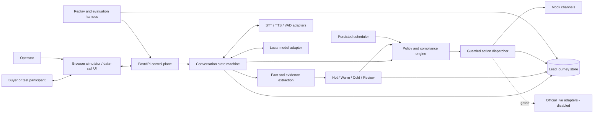
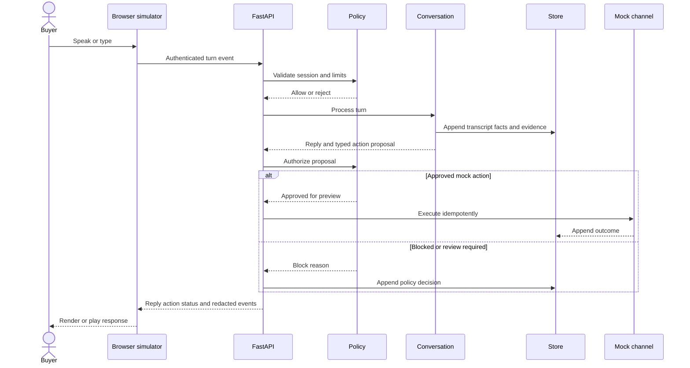
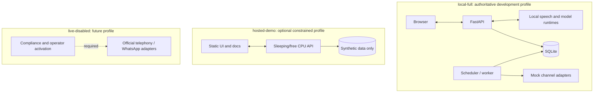
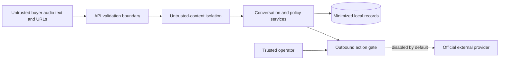

# Architecture

## Status

This document describes the target architecture. The current implementation includes the audited FastAPI foundation, default-off configuration, typed domain contracts, Alembic-managed local persistence, provider contracts, deterministic mocks, resilience primitives, a process-local browser simulator, and speech/runtime benchmark manifests and metrics. Storage/adapters are not yet connected to simulator conversation flows, and no production model is selected. Components marked as planned must not be represented as working capabilities.

## Principles

- Local-first and zero-cost for development and evaluation.
- Provider-neutral interfaces for speech, models, channels, storage, scheduling, artifacts, and clocks.
- Deterministic policy code authorizes every external action.
- Models propose structured outputs; they never directly execute side effects.
- Append-only lead journeys preserve evidence and requirement revisions.
- English, Hindi, and code-switching are first-class evaluation dimensions.
- External effects fail closed and remain disabled by default.

## Component view

## Simulated-call sequence

## Deployment profiles

### `local-full`

Target for complete development and deterministic evaluation on existing hardware. It may use Docker Compose later, but no container packaging exists yet.

### `hosted-demo`

Optional synthetic-data-only demonstration. Free hosting can sleep, cold-start, change quotas, or disappear. It is not an availability commitment and cannot enable external side effects.

### `live-disabled`

Contains only official provider integrations after a separate review. Activation requires secrets outside source control, allowlisted participants, consent and contact-policy checks, operator approval, and usage caps.

## Data flow and trust boundaries

Data entering from transcripts, websites, prior notes, models, and providers is untrusted. It cannot alter system instructions, credentials, policies, or tool authorization.

## Provider boundaries

Planned interfaces:

- Streaming STT, TTS, optional STS, and VAD.
- Structured local-model completion.
- Telephony and WhatsApp messaging/calling where officially supported.
- Scheduling and replaceable clocks.
- Lead/event storage and object storage.
- Safe web research and artifact generation.

Contract tests must ensure swapping a provider does not change domain or policy behavior.

The interfaces, disabled external adapters, deterministic mocks, retry/timeout helper, circuit breaker, and clocks are implemented. Concrete provider integrations remain planned. See [Provider contracts and deterministic mocks](PROVIDER_CONTRACTS.md).

## Availability and latency

- Measure latency by capture, VAD, STT, reasoning, policy, TTS, and playback stages.
- Bound queues and apply backpressure instead of buffering without limit.
- Persist schedules and idempotency keys before attempting actions.
- Fail closed for policy/provider uncertainty; degrade to text or operator review where safe.
- Do not advertise real-time latency until measured on labeled target hardware.
